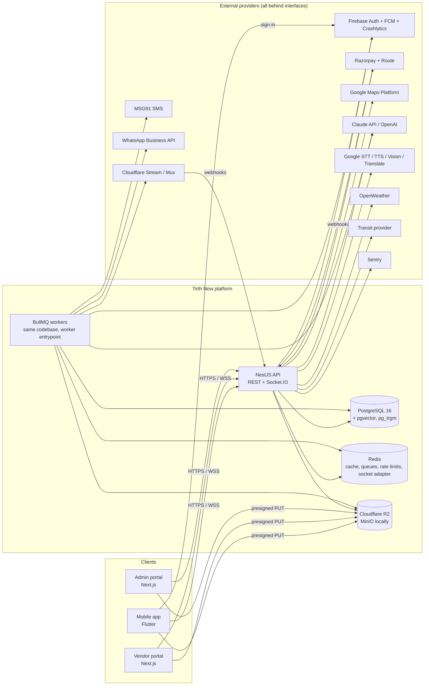
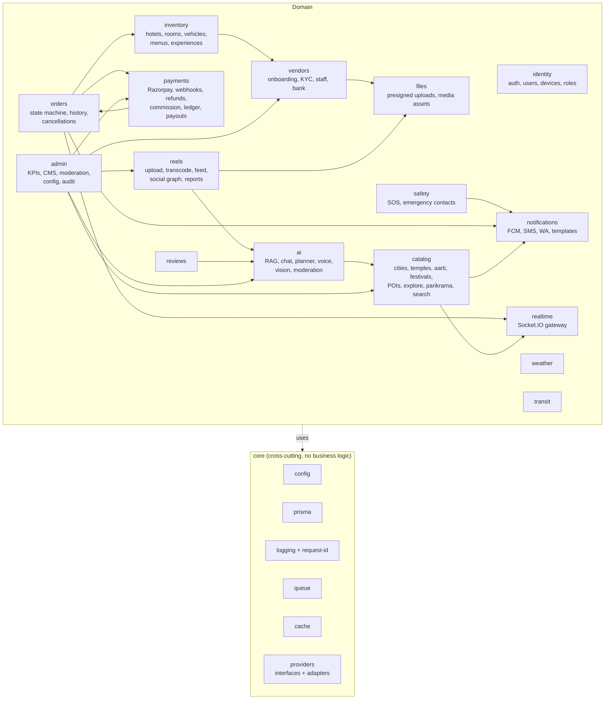
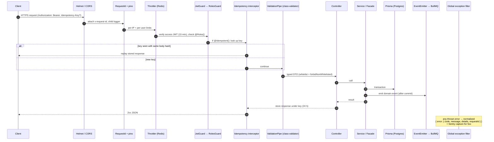
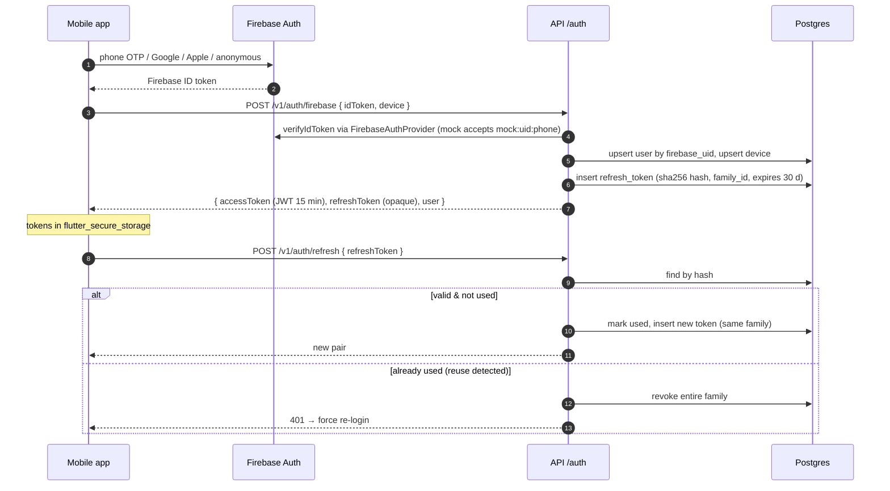
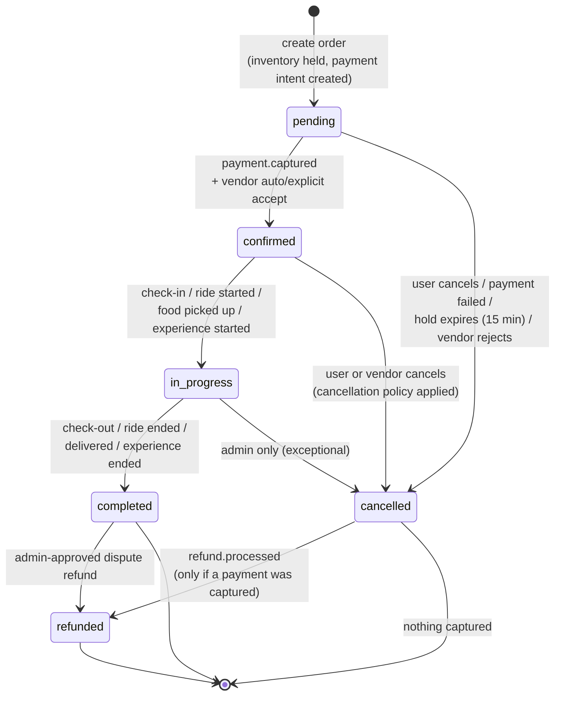
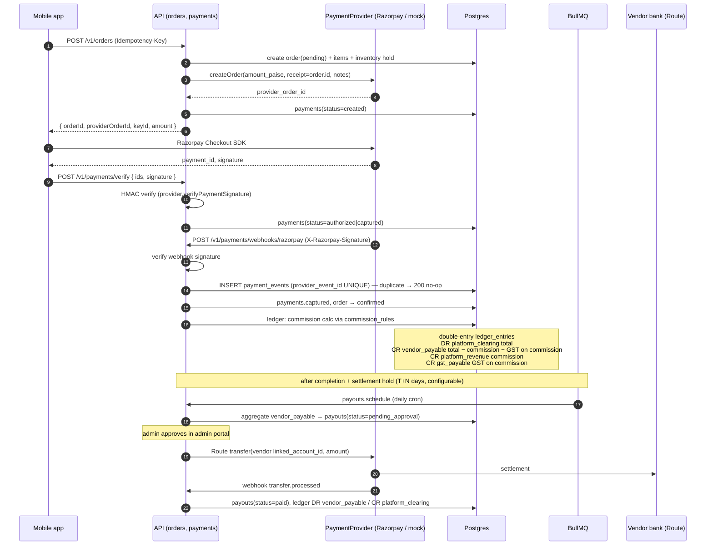
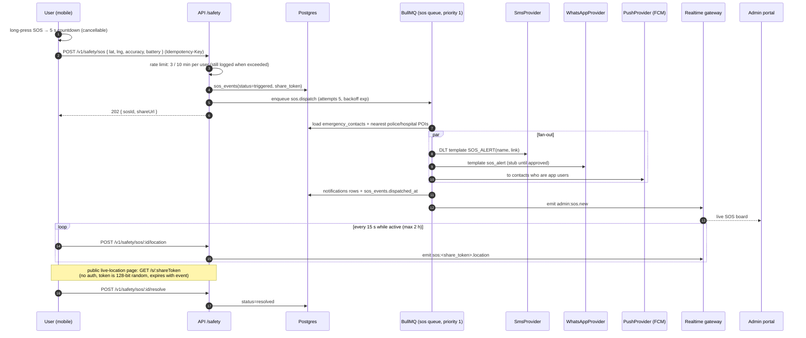
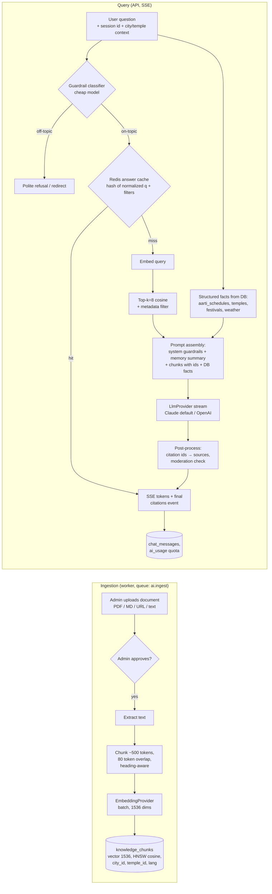

# Tirth Now — Architecture

Tirth Now is a spiritual travel and discovery super-app for the Braj region
(Mathura, Vrindavan, Goverdhan, Barsana, Gokul, Nandgaon). One backend serves
three clients:

| Client | Tech | Audience |
|---|---|---|
| Mobile app | Flutter 3 (Android + iOS) | Pilgrims, tourists, locals |
| Vendor portal | Next.js 14 (App Router) | Hotels, cab operators, restaurants, experience hosts |
| Admin portal | Next.js 14 (App Router) | Tirth Now operations, content, finance, trust & safety |

Guiding principles:

1. **Modular monolith** — one deployable NestJS API, strict module boundaries (ADR-0001).
2. **Provider interfaces everywhere** — every third-party call sits behind an interface with a real and a mock adapter, selected by env (ADR-0003). The full stack runs locally with zero external accounts.
3. **Firebase for client identity, own JWT for authorization** (ADR-0002).
4. **One order state machine** for every bookable thing (ADR-0004).
5. **Money is integer paise. Time is UTC in storage, Asia/Kolkata on display.**
6. **Idempotency** on payment, booking and SOS endpoints.

---

## 1. System context



### Deployable units

| Unit | Entrypoint | Notes |
|---|---|---|
| `api` (HTTP) | `apps/api/src/main.ts` | REST, Swagger at `/docs`, Socket.IO gateway (Redis adapter for horizontal scale) |
| `api` (worker) | `apps/api/src/worker.ts` | Same image, different command. Runs BullMQ processors and cron schedulers. No HTTP listener except `/healthz`. |
| `vendor-portal` | Next.js server | Talks to API only through `@tirth-now/api-client` |
| `admin-portal` | Next.js server | Same |
| `mobile` | Store builds via Codemagic | Talks to API through a Dio client generated/handwritten against OpenAPI |

---

## 2. Module boundaries (API)



### Boundary rules

1. A module exposes a **public service facade** (`<module>.facade.ts` exporting a `@Injectable` class) and its DTO/event types from `index.ts`. Other modules import **only** from that `index.ts`. Enforced by an ESLint `no-restricted-imports` rule (`@/modules/*/!(index)`).
2. A module owns its tables. Only that module's repository code queries them. Cross-module reads go through the facade; cross-module writes go through the facade or a domain event.
3. **Domain events** (in-process, `@nestjs/event-emitter`) for fire-and-forget reactions — e.g. `order.confirmed` → notifications, realtime, ledger. Anything that must survive a crash is pushed onto a BullMQ queue by the listener.
4. `payments` ↔ `orders` is the one intentional bidirectional relationship: orders calls `PaymentsFacade.createIntent()`; payments emits `payment.captured` / `refund.processed` events that orders consumes. No direct circular imports.
5. `admin` is an orchestration layer: it owns `audit_logs` and `app_config`, and calls other modules' facades for everything else.
6. No module calls an external SDK directly — only through `core/providers`.

### Module → table ownership (summary)

| Module | Owns |
|---|---|
| identity | users, user_profiles, roles, user_roles, devices, refresh_tokens, emergency_contacts* (shared with safety via facade) |
| catalog | cities, temples, aarti_schedules, festivals, pois, explore_items, parikrama_routes, parikrama_route_stops |
| files | media_assets |
| vendors | vendors, vendor_kyc_documents, vendor_staff, vendor_bank_accounts |
| inventory | hotels, room_types, room_inventory, vehicles, cab_fares, restaurants, menu_items, experiences, experience_slots |
| orders | orders, order_items, order_status_history, cancellations, idempotency_keys |
| payments | payments, payment_events, refunds, commission_rules, ledger_entries, payouts |
| reviews | reviews |
| reels | reels, reel_likes, reel_comments, reel_saves, follows, reports, moderation_actions |
| ai | knowledge_documents, knowledge_chunks, chat_sessions, chat_messages, itineraries, itinerary_days, itinerary_items, ai_usage |
| safety | sos_events (emergency_contacts read via identity facade) |
| notifications | notifications, notification_templates |
| admin | audit_logs, app_config |

\* `emergency_contacts` lives in identity (it is profile data) and is read by safety.

### Folder layout inside `apps/api/src`

```
main.ts                 # HTTP bootstrap
worker.ts               # BullMQ worker bootstrap
app.module.ts
core/
  config/               # Zod env schema → typed ConfigService
  prisma/
  logging/              # pino, request-id middleware
  http/                 # exception filter, interceptors, pipes
  auth/                 # JwtGuard, RolesGuard, @Roles(), @CurrentUser()
  idempotency/          # @Idempotent() interceptor backed by idempotency_keys
  queue/                # BullMQ module + queue names
  cache/
  providers/
    payment/            # payment.provider.ts, razorpay.adapter.ts, mock.adapter.ts
    sms/  whatsapp/  push/  maps/  llm/  embedding/  stt/  tts/
    vision/  translate/  storage/  video/  weather/  transit/  firebase-auth/
modules/
  identity/  catalog/  vendors/  inventory/  orders/  payments/  reviews/
  reels/  ai/  safety/  notifications/  weather/  transit/  files/
  realtime/  admin/
    <module>.module.ts
    <module>.facade.ts
    index.ts
    controllers/  services/  dto/  events/  processors/  __tests__/
```

---

## 3. Request flow



### Auth token exchange



Portals use `POST /v1/auth/portal/login` (email + argon2id password, optional
email/SMS OTP second step) and receive the same token pair; the portal stores the
refresh token in an `httpOnly; Secure; SameSite=Strict` cookie set by a Next.js
route handler, never in JS-accessible storage.

---

## 4. Booking (order) state machine

All bookable products — `hotel`, `cab`, `food`, `experience`, `transit` — share
one `orders` table and one state machine (ADR-0004). Type-specific details live
in `order_items` and the type-specific inventory hold.



Rules:

- Transitions are declared in one table (`ORDER_TRANSITIONS`) mapping `from → to → { allowedActors, guard, sideEffects }`. `OrdersService.transition(orderId, to, actor, reason)` is the **only** writer of `orders.status`.
- Every transition runs in a DB transaction with `SELECT … FOR UPDATE` on the order row, writes `order_status_history (from, to, actor_type, actor_id, reason, metadata)`, then emits `order.<status>` after commit.
- Partial refunds keep the order in its current terminal state and record a `refunds` row; `refunded` means fully refunded.
- Inventory holds: hotel nights decrement `room_inventory.available` inside the order-create transaction (row lock per date); a `release-expired-holds` repeatable job cancels `pending` orders past `hold_expires_at` and restores inventory.
- `transit` orders are deep-link / affiliate bookings in v1: created as `pending`, marked `confirmed` by provider callback or remain informational.

---

## 5. Payment + payout flow



Refunds: `POST /v1/orders/:id/cancel` → cancellation policy computes refundable
paise → `PaymentProvider.refund()` → `refunds(status=pending)` → webhook
`refund.processed` → `refunds(status=processed)`, reversing ledger entries, order
→ `refunded` when fully refunded. If a vendor was already paid out, a negative
`vendor_payable` balance is carried forward to the next payout.

---

## 6. SOS flow



---

## 7. RAG pipeline (AI Braj Guide)



Key rules:

- **Aarti times are never generated by the model.** The planner and chat use a `get_aarti_schedule(temple_id, date)` tool backed by `aarti_schedules`; the system prompt forbids stating times not present in tool output.
- Model routing: a cheap model handles classification, short factual queries and moderation; the default model handles chat and itinerary generation. Both are configured by env (`LLM_MODEL_DEFAULT`, `LLM_MODEL_CHEAP`).
- Per-user daily quota (`AI_DAILY_QUOTA_*`) tracked in Redis, persisted to `ai_usage` for reporting.
- Trip planner output is JSON validated with a Zod schema from `@tirth-now/shared-types`; invalid output is retried once with the validation errors appended, then fails gracefully.

---

## 8. Async work (BullMQ queues)

| Queue | Producers | Jobs | Retry policy |
|---|---|---|---|
| `sos` | safety | dispatch, location fan-out | 5 attempts, exp backoff 2 s, priority 1 |
| `notifications` | many | push, sms, whatsapp, email, scheduled aarti reminders | 5 attempts, exp backoff |
| `payments` | payments | webhook post-processing, refund polling, reconciliation | 8 attempts |
| `payouts` | cron, admin | schedule, execute transfer | 3 attempts, then manual |
| `orders` | cron | release expired holds, auto-complete | 3 attempts |
| `media` | reels, files | transcode (VideoProvider), image resize, thumbnails | 3 attempts |
| `ai` | ai, admin | ingest document, embed chunks, moderate content | 3 attempts |

Repeatable jobs: aarti reminder scheduler (every 5 min), expired hold release
(every minute), payout scheduling (daily 02:00 IST), weather pre-warm (every 15 min).

---

## 9. Realtime

Socket.IO gateway at `/rt` with the Redis adapter. Clients authenticate with the
access JWT in the handshake `auth.token`. Rooms:

| Room | Who joins | Events |
|---|---|---|
| `aarti:<templeId>` | anyone | `aarti.countdown`, `aarti.live` |
| `order:<orderId>` | order owner, vendor staff, admin | `order.status`, `cab.location` |
| `vendor:<vendorId>` | vendor staff | `order.new`, `order.status` |
| `admin` | admins | `sos.new`, `moderation.new`, `kpi.tick` |
| `sos:<shareToken>` | public share viewers (read-only) | `sos.location` |

Countdowns are computed on the client from server-provided `next_at` timestamps;
the server only pushes on schedule changes, so the gateway stays cheap.

---

## 10. Cross-cutting concerns

| Concern | Approach |
|---|---|
| Config | Zod schema validates `process.env` at boot; app refuses to start on invalid config |
| Logging | pino JSON, `x-request-id` propagated to workers via job data; PII redaction paths for phone, email, tokens |
| Errors | One error envelope `{ error: { code, message, details?, requestId } }`; stable `code` strings shared in `@tirth-now/shared-types` |
| Validation | class-validator in API; Zod in portals (schemas from `shared-types`); Flutter form validators |
| Rate limiting | `@nestjs/throttler` with Redis storage; stricter buckets for auth, OTP, SOS, AI |
| Security | Helmet, strict CORS allowlist, argon2id for portal passwords, refresh tokens hashed (sha256), webhook signature verification, presigned URLs with content-type + size limits, RBAC guard on every non-public route |
| Observability | Sentry (API, portals, Flutter), Crashlytics, `/healthz` (liveness) and `/readyz` (DB + Redis) |
| i18n | `*_i18n` JSONB columns `{ "en": "...", "hi": "..." }` for CMS content; Flutter ARB files for UI copy |
| Time | `timestamptz` in UTC; `Asia/Kolkata` conversion only at presentation; aarti schedules stored as local wall-clock `time` + rules, resolved to UTC instants per date by the catalog service |
| Money | `integer` paise columns suffixed `_paise`; `bigint` for ledger/aggregates; no floats anywhere |
| API versioning | URI prefix `/v1` |

---

## 11. Environments

| Env | Infra | Providers |
|---|---|---|
| local | docker-compose: Postgres 16 + pgvector, Redis 7, MinIO, Mailpit | all `mock` |
| ci | service containers | all `mock` |
| staging | managed Postgres + Redis, R2 | real sandbox/test keys |
| production | same, scaled API + worker | real |

See `docs/INTEGRATIONS.md` for every provider and its env vars.
