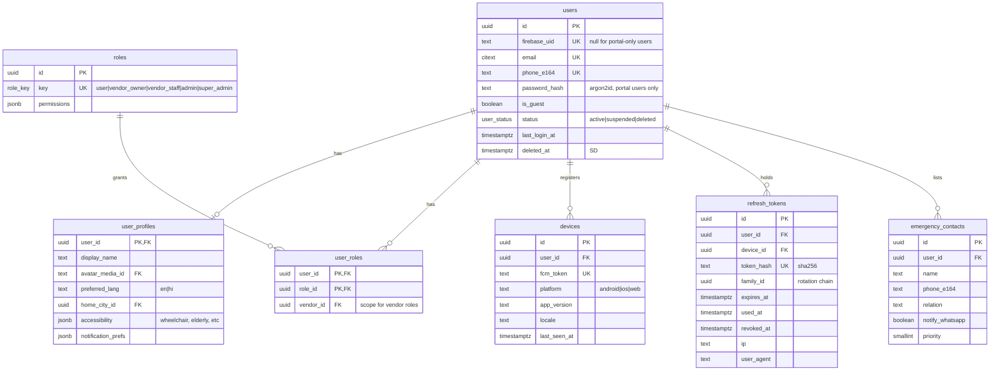
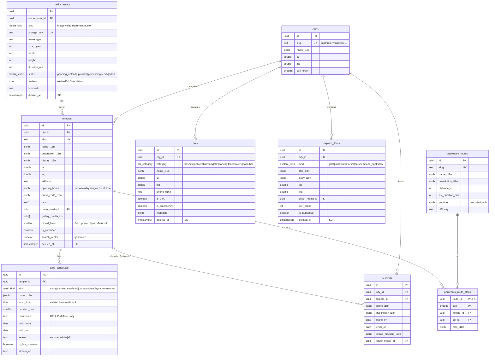
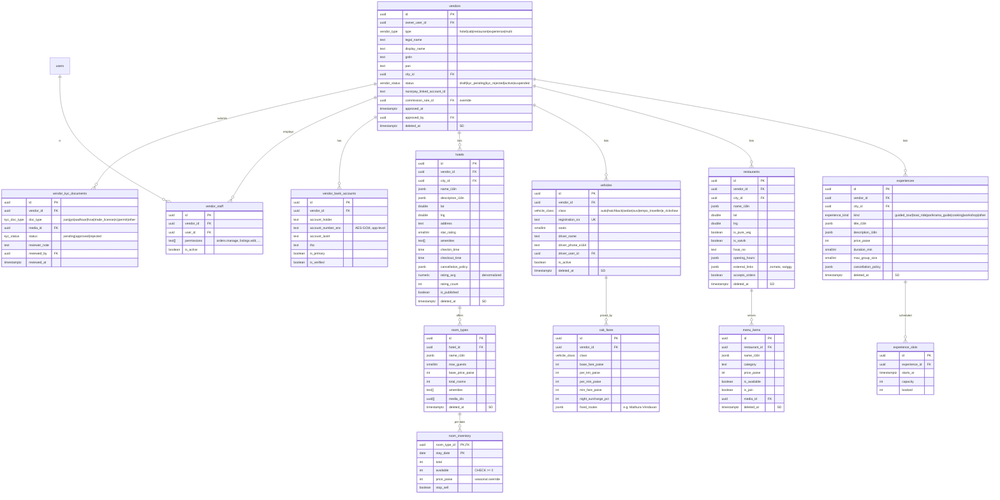
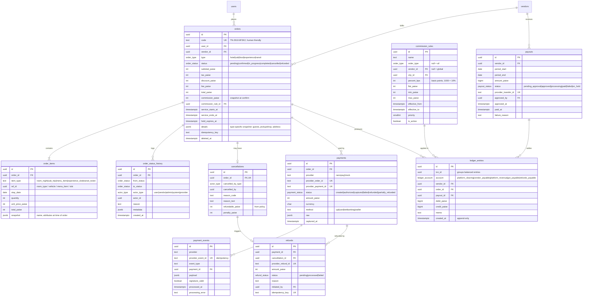
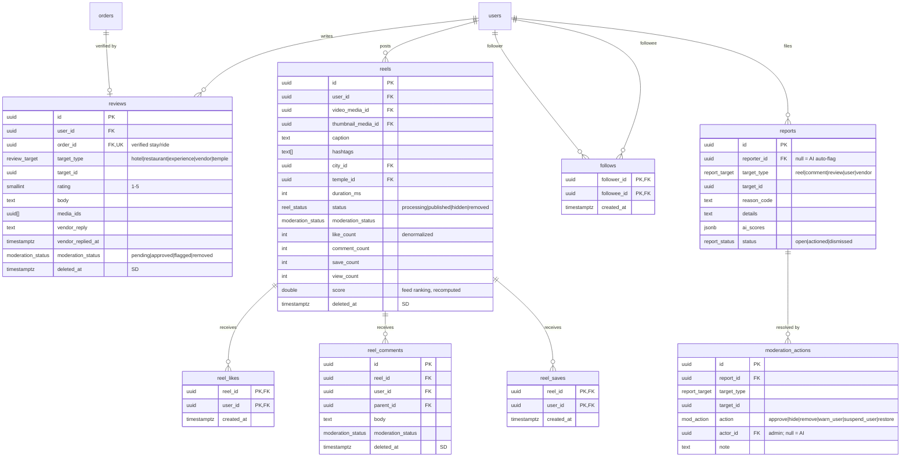
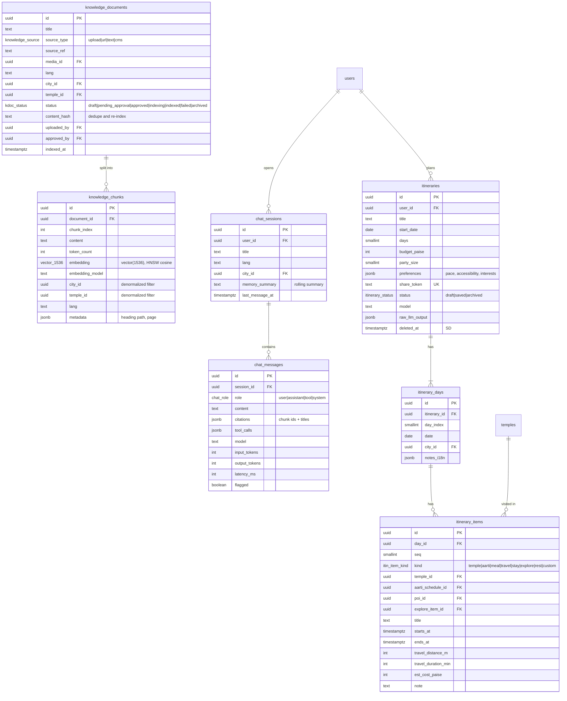
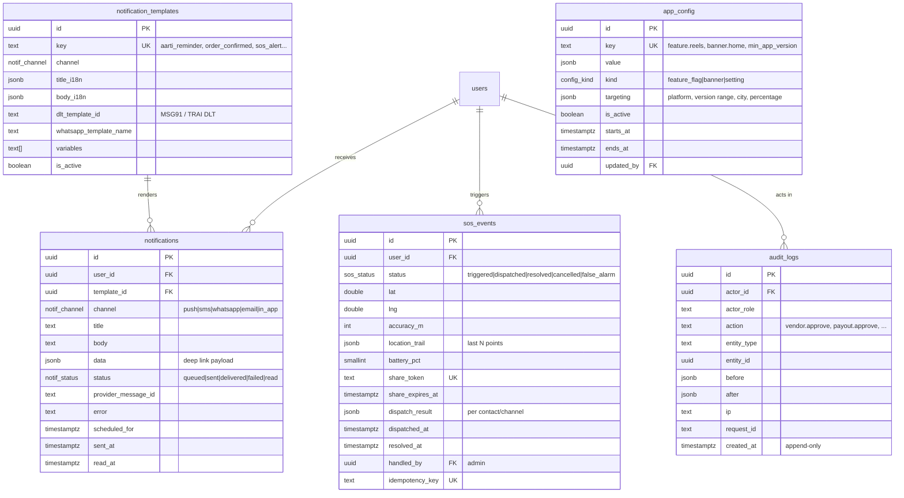

# Tirth Now — Data Model

PostgreSQL 16 with extensions `pgcrypto` (UUIDs), `pg_trgm` (fuzzy search),
`unaccent`, `vector` (pgvector), `citext`. Schema is defined in Prisma
(`apps/api/prisma/schema.prisma`); raw-SQL migrations add what Prisma cannot
express (HNSW/GIN indexes, generated `tsvector` columns, partial unique indexes,
check constraints).

## Conventions

| Convention | Rule |
|---|---|
| Primary keys | `id uuid DEFAULT gen_random_uuid()` |
| Timestamps | `created_at timestamptz NOT NULL DEFAULT now()`, `updated_at timestamptz NOT NULL` (Prisma `@updatedAt`). All UTC. Display in `Asia/Kolkata`. |
| Soft delete | `deleted_at timestamptz NULL` on user-facing/catalog/vendor tables (marked **SD** below). Prisma client extension filters `deleted_at IS NULL` by default. Unique indexes are partial (`WHERE deleted_at IS NULL`). |
| Money | `integer` paise, column suffix `_paise` (max ≈ ₹2.1 crore per row). Ledger and aggregates use `bigint`. Currency is always INR; a `currency char(3) DEFAULT 'INR'` column exists on payments for future-proofing. |
| Enums | Postgres enums via Prisma for closed sets (status, type). Open sets (POI category, amenity) are text + check or lookup table. |
| i18n | Translatable CMS text in `*_i18n jsonb` shaped `{"en": "...", "hi": "..."}`; `en` required. |
| Geo | `lat double precision`, `lng double precision` + btree index on `(lat, lng)`; distance via haversine SQL function. (PostGIS deferred — ADR candidate if geo queries grow.) |
| Naming | snake_case tables (plural) and columns; Prisma models PascalCase singular with `@@map`. |
| FKs | `ON DELETE RESTRICT` by default; `CASCADE` only for pure child rows (e.g. `order_items`, `reel_likes`). |
| Audit | Every admin/vendor write produces an `audit_logs` row (via interceptor). |

---

## ERD — Identity

## ERD — Catalog & media

## ERD — Vendors & inventory

## ERD — Orders & payments

## ERD — Reviews, reels & moderation

## ERD — AI

## ERD — Ops

Supporting tables not drawn above: `idempotency_keys` (key, scope, user_id,
request_hash, response_status, response_body, expires_at — unique on
`(scope, user_id, key)`) and `ai_usage` (user_id, date, requests, input_tokens,
output_tokens, cost_micros — PK `(user_id, date)`).

---

## Table notes

### Identity
- **users** — one row per human. Mobile users key on `firebase_uid`; portal users key on `email` + `password_hash`. A user can be both (vendor owner who also uses the app). Guests (`is_guest=true`) are upgraded in place when they link a phone/Google/Apple credential — Firebase preserves the uid.
- **roles / user_roles** — five roles seeded. Vendor roles carry a `vendor_id` scope; the JWT includes `roles[]` and `vendorIds[]`. Fine-grained vendor staff permissions are in `vendor_staff.permissions`.
- **refresh_tokens** — only sha256 hashes stored. `family_id` enables reuse detection: presenting a used token revokes the whole family.
- **devices** — FCM token is unique; re-registering moves it to the current user (shared phones).

### Catalog
- **aarti_schedules** store *local wall-clock* time plus an RRULE and validity window because temple timings change with season (summer/winter) and festivals. `CatalogService.getAartiInstances(templeId, dateRange)` expands them into UTC instants. This is the single source the AI module is allowed to quote.
- **temples.search_vector** — generated `tsvector` from `name_i18n` + tags (`simple` config so Hindi tokens survive) with a GIN index; plus `gin_trgm_ops` index on `name_i18n->>'en'` and `->>'hi'` for fuzzy/typo search.
- **pois** — the safety directory is `pois WHERE is_emergency = true`; cached offline on mobile.
- **media_assets** — every uploaded file. Clients request a presigned PUT (`files` module) which creates a `pending_upload` row; the client confirms, the worker validates (mime sniff, size), produces variants, and flips to `ready`.

### Vendors & inventory
- **vendors.status** workflow: `draft → kyc_pending → (kyc_rejected ↔ kyc_pending) → active ↔ suspended`. Only `active` vendors' listings are visible.
- **vendor_bank_accounts.account_number_enc** — encrypted at the application layer with a key from env (`DATA_ENCRYPTION_KEY`); only `last4` is ever returned to clients.
- **room_inventory** is date-level: one row per `(room_type, stay_date)`. Booking N nights locks N rows `FOR UPDATE` in ascending date order (deadlock-safe) and decrements `available`; `CHECK (available >= 0)` is the last line of defence against overbooking. Rows are materialized 365 days ahead by a nightly job and on room-type creation.
- **cab_fares** — fare estimate = `max(min_fare, base + per_km·km + per_min·min) × (1 + night_surcharge)` computed in integer paise with banker's rounding at the end; distance/duration from `MapsProvider`.
- **experience_slots** — `booked <= capacity` enforced with a check constraint and row lock, mirroring room inventory.

### Orders
- **orders.details** snapshots everything needed to display the order without joining mutable catalog data (hotel name, address, room name, pickup/drop, menu names).
- **orders.idempotency_key** + `idempotency_keys` table: the create endpoint returns the original order for a repeated key.
- **order_status_history** is append-only and is the audit trail for disputes.

### Payments
- **payment_events.provider_event_id UNIQUE** makes the webhook handler idempotent: insert-or-ignore, and only the inserting request processes the event. Signature-invalid events are stored with `signature_valid=false` and not processed.
- **commission_rules** resolution: most specific active rule wins (vendor > city+type > type > global), tie-broken by `priority`. The resolved rule id and amount are snapshotted onto the order at confirmation so later rule edits don't change history.
- **ledger_entries** — append-only, double-entry; each `txn_id` group must balance (sum debits = sum credits), enforced by a deferred constraint trigger. Vendor balance = Σ(credit − debit) on `vendor_payable` for that vendor.
- **payouts** require admin approval (`pending_approval → approved`) before the Route transfer executes.

### Reviews & reels
- **reviews.order_id** unique → one verified review per completed order. Reviews on temples have no order.
- **reels** counters are denormalized and updated by the same transaction as the like/save/comment write (or by a periodic reconciler). `score` is recomputed by a job: recency decay + engagement + locality boost + creator follow graph.
- **reports** with `reporter_id IS NULL` are AI auto-flags from the moderation job.

### AI
- **knowledge_chunks.embedding** — `vector(1536)` with an HNSW index (`vector_cosine_ops`). If the embedding provider's dimension differs, the adapter must project/choose a 1536-dim model; changing dimension requires a migration + re-index (documented in ADR-0003 consequences).
- **chat_sessions.memory_summary** — rolling summary updated every N turns by the cheap model to bound context size.
- **itineraries** — the structured result is normalized into days/items so users can edit individual items; `raw_llm_output` is kept for debugging. `share_token` enables a public read-only link.

### Ops
- **notification_templates.dlt_template_id** — TRAI DLT requires pre-registered SMS templates; the SMS adapter refuses to send a template without one in production.
- **sos_events** — `location_trail` holds the last ~240 points (2 h at 30 s); older points are discarded. `share_token` is 128-bit random, URL-safe, and expires at resolution + 1 h.
- **audit_logs** — append-only (no UPDATE/DELETE grants for the app role in production).
- **app_config** — feature flags, banners, min app version; read by clients via `GET /v1/config` (cached 60 s).

---

## Indexes worth calling out

| Table | Index |
|---|---|
| temples | GIN(`search_vector`), GIN trigram on names, `(city_id) WHERE deleted_at IS NULL AND is_published` |
| aarti_schedules | `(temple_id, local_time)` |
| pois | `(city_id, category)`, `(lat, lng)` |
| room_inventory | PK `(room_type_id, stay_date)` |
| orders | `(user_id, created_at DESC)`, `(vendor_id, status, created_at DESC)`, partial `(hold_expires_at) WHERE status='pending'` |
| payment_events | UNIQUE `(provider, provider_event_id)` |
| ledger_entries | `(vendor_id, account, created_at)` |
| reels | `(status, score DESC)`, `(user_id, created_at DESC)`, GIN(`hashtags`) |
| knowledge_chunks | HNSW(`embedding vector_cosine_ops`), `(city_id)`, `(temple_id)` |
| notifications | `(user_id, created_at DESC)`, partial `(scheduled_for) WHERE status='queued'` |
| idempotency_keys | UNIQUE `(scope, user_id, key)`, `(expires_at)` |
